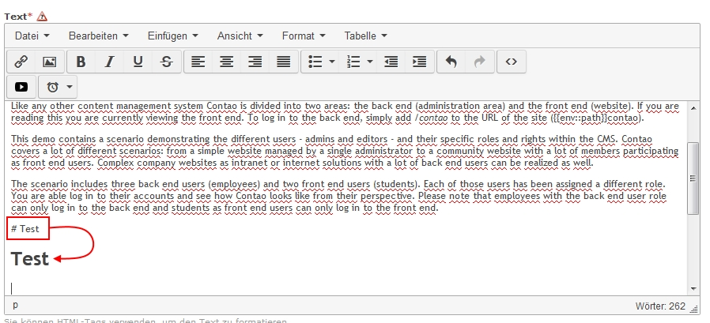

Contao Extension: TinyMceTextPattern
====================================

Special TinyMCE plugin that matches special patterns in the text and applies formats or executed commands on these text patterns.

The sources of this plugin could be found [here](http://www.tinymce.com/wiki.php/Plugin:textpattern).

Now for TinyMCE 4.

Installation
------------

Install the extension via composer: [cliffparnitzky/tiny-mce-text-pattern](https://packagist.org/packages/cliffparnitzky/tiny-mce-text-pattern).

If you prefer to install it manually, download the latest release here: https://github.com/cliffparnitzky/TinyMceTextPattern/releases

Tracker
-------

https://github.com/cliffparnitzky/TinyMceTextPattern/issues

Compatibility
-------------

- min. Contao version: >= 3.3.0
- max. Contao version: <  3.5.0

Dependency
----------

- To load this plugin and add it to the configuration the extension [[TinyMcePluginLoader]](https://github.com/cliffparnitzky/TinyMcePluginLoader) has to be installed.

Screenshot
----------

